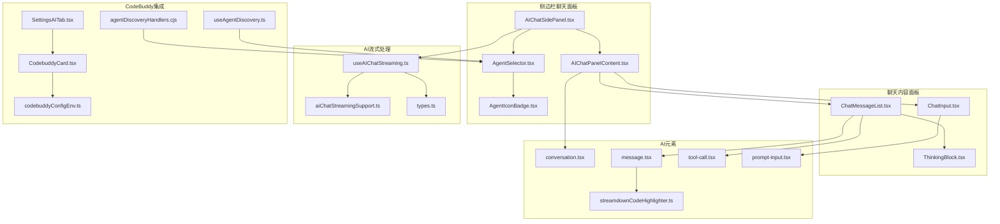
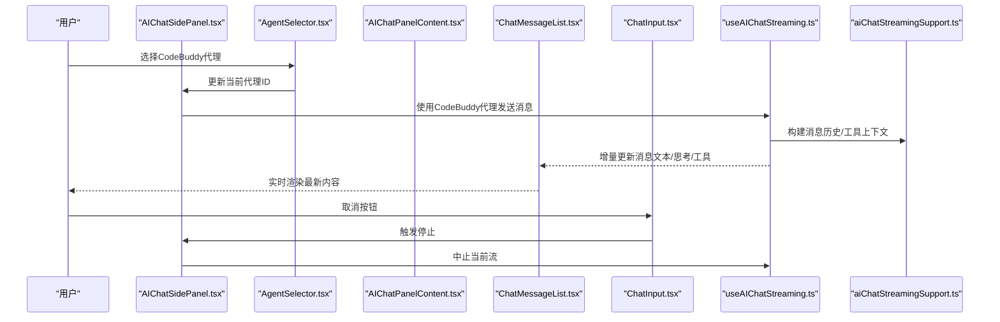
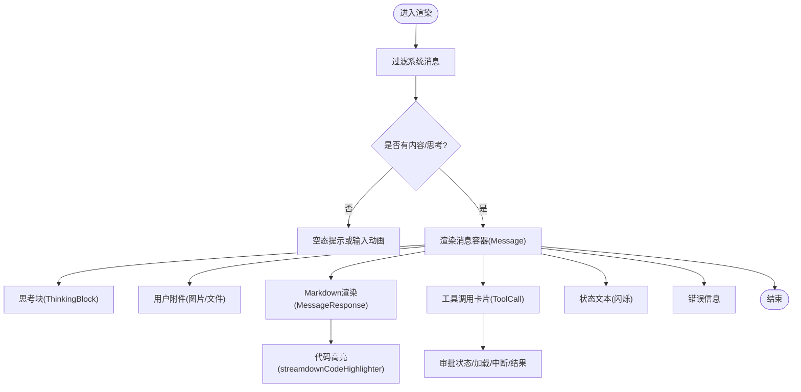
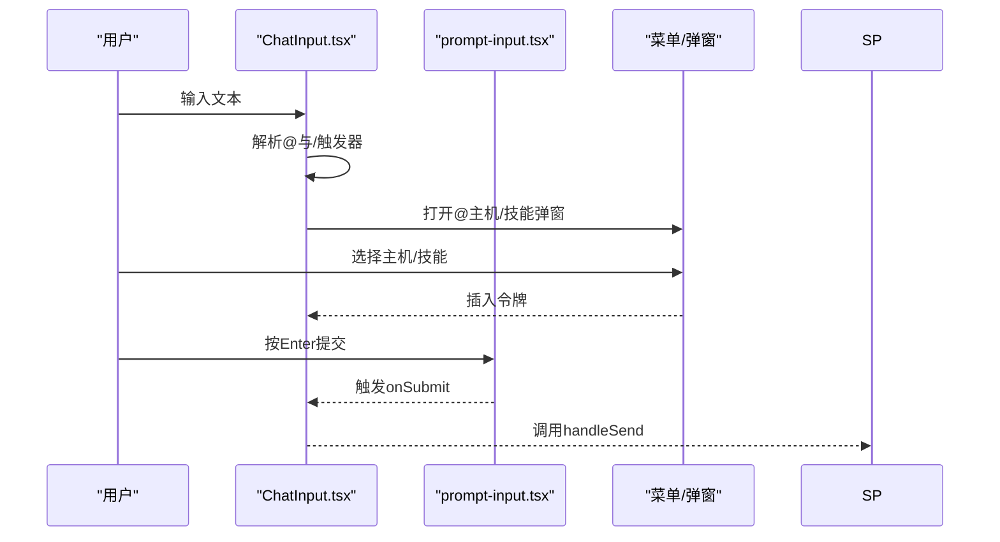
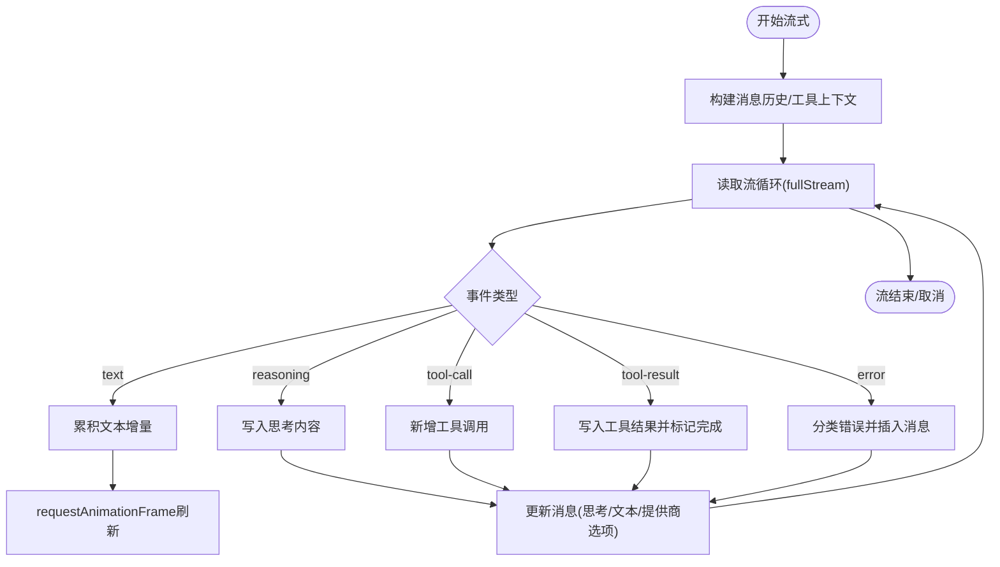
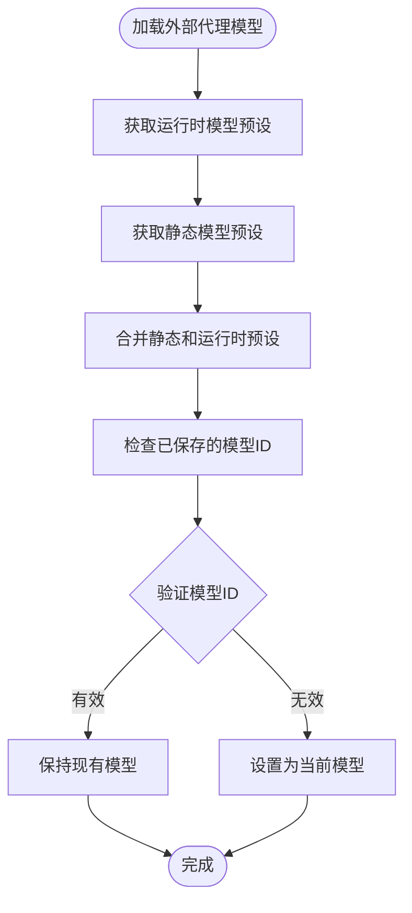
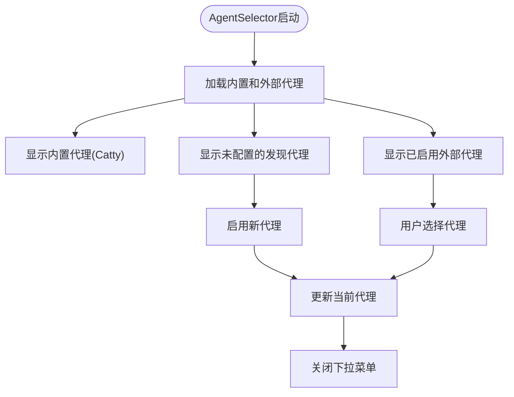
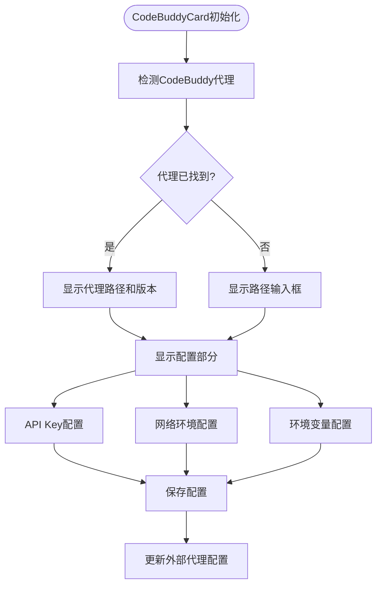
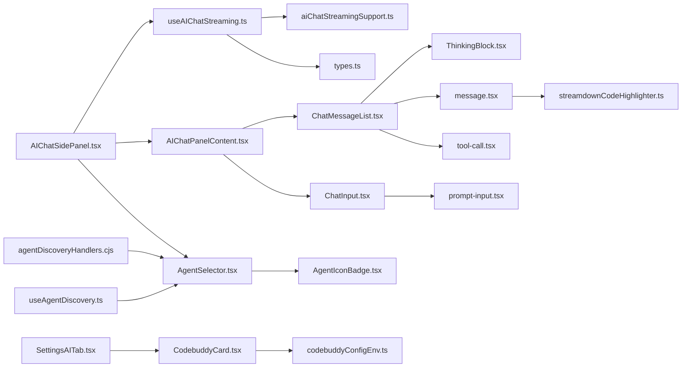

# AI聊天界面

<cite>
**本文档引用的文件**
- [AIChatPanelContent.tsx](file://components/AIChatPanelContent.tsx)
- [AIChatSidePanel.tsx](file://components/AIChatSidePanel.tsx)
- [AIChatSidePanelHelpers.ts](file://components/AIChatSidePanelHelpers.ts)
- [AIChatSidePanel.types.ts](file://components/AIChatSidePanel.types.ts)
- [ChatMessageList.tsx](file://components/ai/ChatMessageList.tsx)
- [ChatInput.tsx](file://components/ai/ChatInput.tsx)
- [ThinkingBlock.tsx](file://components/ai/ThinkingBlock.tsx)
- [conversation.tsx](file://components/ai-elements/conversation.tsx)
- [message.tsx](file://components/ai-elements/message.tsx)
- [tool-call.tsx](file://components/ai-elements/tool-call.tsx)
- [prompt-input.tsx](file://components/ai-elements/prompt-input.tsx)
- [streamdownCodeHighlighter.ts](file://components/ai-elements/streamdownCodeHighlighter.ts)
- [useAIChatStreaming.ts](file://components/ai/hooks/useAIChatStreaming.ts)
- [aiChatStreamingSupport.ts](file://components/ai/hooks/aiChatStreamingSupport.ts)
- [types.ts](file://infrastructure/ai/types.ts)
- [aiPanelViewState.ts](file://components/ai/aiPanelViewState.ts)
- [AgentIconBadge.tsx](file://components/ai/AgentIconBadge.tsx)
- [AgentSelector.tsx](file://components/ai/AgentSelector.tsx)
- [CodebuddyCard.tsx](file://components/settings/tabs/ai/CodebuddyCard.tsx)
- [codebuddyConfigEnv.ts](file://components/settings/tabs/ai/codebuddyConfigEnv.ts)
- [SettingsAITab.tsx](file://components/settings/tabs/SettingsAITab.tsx)
- [agentDiscoveryHandlers.cjs](file://electron/bridges/aiBridge/agentDiscoveryHandlers.cjs)
- [useAgentDiscovery.ts](file://application/state/useAgentDiscovery.ts)
- [ai.ts](file://application/i18n/locales/zh-CN/ai.ts)
</cite>

## 更新摘要
**变更内容**
- 修复了AI聊天侧边面板组件中的模型验证和持久化bug
- 新增了双重验证机制，确保静态模型预设（如CodeBuddy的'auto'设置）在组件刷新时得到正确保留
- 避免不必要的模型覆盖，提升用户体验稳定性

## 目录
1. [简介](#简介)
2. [项目结构](#项目结构)
3. [核心组件](#核心组件)
4. [架构总览](#架构总览)
5. [详细组件分析](#详细组件分析)
6. [依赖关系分析](#依赖关系分析)
7. [性能考虑](#性能考虑)
8. [故障排查指南](#故障排查指南)
9. [结论](#结论)
10. [附录](#附录)

## 简介
本技术文档围绕AI聊天界面的完整实现进行深入解析，涵盖聊天面板的整体架构、消息列表渲染、输入区域与发送控制、实时流式响应机制、思考状态可视化、以及界面交互最佳实践。文档以代码级细节为基础，结合架构图与流程图，帮助开发者快速理解并扩展该功能。

**更新** 新增CodeBuddy Code AI代理支持，包括代理识别、模型预设处理以及在AgentIconBadge中的视觉标识。**新增** 修复了模型验证和持久化bug，确保静态模型预设在组件刷新时得到正确保留。

## 项目结构
AI聊天界面由"侧边栏聊天面板"和"聊天内容面板"两大部分组成，配合AI流式处理钩子与消息元素组件共同完成端到端的交互体验。新增的CodeBuddy代理通过AgentSelector和AgentIconBadge组件集成到现有架构中。

**图表来源**
- [AIChatSidePanel.tsx:48-909](file://components/AIChatSidePanel.tsx#L48-L909)
- [AIChatPanelContent.tsx:1-249](file://components/AIChatPanelContent.tsx#L1-L249)
- [AgentSelector.tsx:1-300](file://components/ai/AgentSelector.tsx#L1-L300)
- [AgentIconBadge.tsx:1-242](file://components/ai/AgentIconBadge.tsx#L1-L242)
- [CodebuddyCard.tsx:1-186](file://components/settings/tabs/ai/CodebuddyCard.tsx#L1-L186)
- [codebuddyConfigEnv.ts:1-67](file://components/settings/tabs/ai/codebuddyConfigEnv.ts#L1-L67)
- [SettingsAITab.tsx:629-657](file://components/settings/tabs/SettingsAITab.tsx#L629-L657)
- [agentDiscoveryHandlers.cjs:1-52](file://electron/bridges/aiBridge/agentDiscoveryHandlers.cjs#L1-L52)
- [useAgentDiscovery.ts:1-42](file://application/state/useAgentDiscovery.ts#L1-L42)

**章节来源**
- [AIChatSidePanel.tsx:48-909](file://components/AIChatSidePanel.tsx#L48-L909)
- [AIChatPanelContent.tsx:1-249](file://components/AIChatPanelContent.tsx#L1-L249)

## 核心组件
- 侧边栏聊天面板：负责会话状态管理、发送/停止控制、外部代理发现与选择、模型/提供商切换、用户技能集成等。
- 聊天内容面板：负责消息列表渲染、输入区、历史抽屉、导出对话等。
- 消息渲染层：基于Streamdown的Markdown渲染、代码高亮、工具调用卡片、思考块等。
- 流式处理钩子：统一处理Catty内置代理与外部代理（ACP/原生进程）的流式输出、错误分类与上报、文本增量合并、思考内容与工具调用的解析与更新。
- **新增** 代理选择器：支持内置代理（Catty）和外部代理（CodeBuddy、Copilot、Claude等）的选择与管理。
- **新增** CodeBuddy集成：完整的CodeBuddy Code AI代理支持，包括检测、配置和环境变量管理。

**章节来源**
- [AIChatSidePanel.tsx:48-909](file://components/AIChatSidePanel.tsx#L48-L909)
- [AIChatPanelContent.tsx:1-249](file://components/AIChatPanelContent.tsx#L1-L249)
- [ChatMessageList.tsx:1-468](file://components/ai/ChatMessageList.tsx#L1-L468)
- [useAIChatStreaming.ts:1-927](file://components/ai/hooks/useAIChatStreaming.ts#L1-L927)
- [AgentSelector.tsx:1-300](file://components/ai/AgentSelector.tsx#L1-L300)
- [CodebuddyCard.tsx:1-186](file://components/settings/tabs/ai/CodebuddyCard.tsx#L1-L186)

## 架构总览
聊天界面采用"视图组件 + 流式处理钩子 + 类型定义"的分层设计。侧边栏面板作为控制器，调度流式钩子；消息列表作为渲染器，消费消息与流式增量；输入区负责构建请求上下文（含附件、用户技能、终端会话等）。新增的代理系统通过AgentSelector组件实现统一的代理管理。

**图表来源**
- [AgentSelector.tsx:118-190](file://components/ai/AgentSelector.tsx#L118-L190)
- [AIChatSidePanel.tsx:647-798](file://components/AIChatSidePanel.tsx#L647-L798)
- [AIChatPanelContent.tsx:174-178](file://components/AIChatPanelContent.tsx#L174-L178)
- [ChatMessageList.tsx:37-514](file://components/ai/ChatMessageList.tsx#L37-L514)
- [ChatInput.tsx:101-264](file://components/ai/ChatInput.tsx#L101-L264)
- [useAIChatStreaming.ts:243-514](file://components/ai/hooks/useAIChatStreaming.ts#L243-L514)
- [aiChatStreamingSupport.ts:1-206](file://components/ai/hooks/aiChatStreamingSupport.ts#L1-L206)

## 详细组件分析

### 聊天消息列表（ChatMessageList）
职责与特性
- 过滤系统消息，仅渲染用户与助手消息。
- 支持思考块（ThinkingBlock）的展开/折叠、时长统计、滚动同步。
- 渲染工具调用卡片（ToolCall），支持审批状态、加载态、中断态、结果态。
- 图片预览弹窗：拖拽平移、缩放、滚轮缩放、重置。
- 空态提示与"正在输入"动画（无内容且未开始时显示）。
- 通过React.memo浅比较优化渲染性能。

消息类型与渲染策略
- 文本消息：使用MessageResponse组件，基于Streamdown渲染Markdown，内置CJK与代码高亮插件。
- 代码块：通过安全代码高亮器（支持语言别名与降级）渲染。
- 工具调用：ToolCall组件展示命令摘要、参数、结果、错误与审批状态。
- 错误信息：标准化错误对象，支持可重试提示。
- 附件：用户图片/文件附件渲染为缩略图或文件标签。

**图表来源**
- [ChatMessageList.tsx:175-324](file://components/ai/ChatMessageList.tsx#L175-L324)
- [message.tsx:55-84](file://components/ai-elements/message.tsx#L55-L84)
- [streamdownCodeHighlighter.ts:59-77](file://components/ai-elements/streamdownCodeHighlighter.ts#L59-L77)
- [tool-call.tsx:132-314](file://components/ai-elements/tool-call.tsx#L132-L314)
- [ThinkingBlock.tsx:28-135](file://components/ai/ThinkingBlock.tsx#L28-L135)

**章节来源**
- [ChatMessageList.tsx:1-468](file://components/ai/ChatMessageList.tsx#L1-L468)
- [message.tsx:1-86](file://components/ai-elements/message.tsx#L1-L86)
- [streamdownCodeHighlighter.ts:1-78](file://components/ai-elements/streamdownCodeHighlighter.ts#L1-L78)
- [tool-call.tsx:1-315](file://components/ai-elements/tool-call.tsx#L1-L315)
- [ThinkingBlock.tsx:1-139](file://components/ai/ThinkingBlock.tsx#L1-L139)

### 聊天输入组件（ChatInput）
功能特性
- 文本输入区：支持多行展开、最大长度限制、粘贴/拖拽文件。
- 文件附件：以芯片形式展示，支持移除；支持图片/文件两类图标。
- 用户技能：支持"/技能"触发器与下拉选择，插入技能令牌。
- @主机提及：在有可用终端会话时，支持@触发与键盘导航。
- 模型/提供商选择：内置模型下拉或两层提供商→模型选择（Catty专用）。
- 底部工具栏：包含附件菜单、模型选择、权限模式（已移除）、发送/停止按钮。
- 快捷键：Enter发送、Shift+Enter换行；Esc关闭弹窗；上下箭头导航。

**图表来源**
- [ChatInput.tsx:187-336](file://components/ai/ChatInput.tsx#L187-L336)
- [prompt-input.tsx:34-110](file://components/ai-elements/prompt-input.tsx#L34-L110)
- [AIChatSidePanel.tsx:647-798](file://components/AIChatSidePanel.tsx#L647-L798)

**章节来源**
- [ChatInput.tsx:1-955](file://components/ai/ChatInput.tsx#L1-L955)
- [prompt-input.tsx:1-215](file://components/ai-elements/prompt-input.tsx#L1-L215)

### 思考状态可视化（ThinkingBlock）
工作原理
- 展示"思考中"标签与时间戳，支持闪烁效果。
- 流式期间自动展开并滚动到底部，便于观察中间过程。
- 结束后自动折叠为"思考了X秒"，点击展开查看全文。
- 预览模式：截断过长内容，折叠时显示简要预览。

用户体验优化
- 自动滚动到最新内容，避免用户手动滚动。
- 折叠后保留时长信息，便于回顾耗时。
- 无障碍：提供aria-expanded与aria-controls，确保屏幕阅读器可用。

**章节来源**
- [ThinkingBlock.tsx:1-139](file://components/ai/ThinkingBlock.tsx#L1-L139)

### 实时流式响应（useAIChatStreaming）
实现原理
- 统一流式接口：Catty内置代理使用Vercel AI SDK streamText；外部代理通过ACP或原生进程。
- 文本增量批处理：使用requestAnimationFrame合并文本增量，减少渲染抖动。
- 思考内容与文本分离：分别处理reasoning与text-delta，支持ProviderContinuation选项注入。
- 工具调用与结果：解析tool-call与tool-result，维护执行状态（running/completed/failed/cancelled）。
- 错误分类与上报：通过classifyError生成标准化错误对象，插入助手消息。
- 中止控制：每个会话独立AbortController，支持中途停止。

**图表来源**
- [useAIChatStreaming.ts:243-514](file://components/ai/hooks/useAIChatStreaming.ts#L243-L514)
- [aiChatStreamingSupport.ts:8-89](file://components/ai/hooks/aiChatStreamingSupport.ts#L8-L89)

**章节来源**
- [useAIChatStreaming.ts:1-927](file://components/ai/hooks/useAIChatStreaming.ts#L1-L927)
- [aiChatStreamingSupport.ts:1-206](file://components/ai/hooks/aiChatStreamingSupport.ts#L1-L206)

### 模型验证与持久化机制

#### 双重验证机制（新增）
**更新** 修复了模型验证和持久化bug，确保静态模型预设在组件刷新时得到正确保留

AIChatSidePanel组件中新增了双重验证机制，专门用于处理外部代理（特别是CodeBuddy）的模型预设验证：

**图表来源**
- [AIChatSidePanel.tsx:517-525](file://components/AIChatSidePanel.tsx#L517-L525)

关键改进：
- **静态预设优先**：对于CodeBuddy等代理，静态预设（如'auto'）始终优先于运行时预设
- **双重验证**：同时验证静态和运行时模型预设，避免不必要的覆盖
- **兼容性处理**：当静态预设存在时，运行时预设会被过滤掉重复项
- **用户体验**：确保用户在组件刷新时不会丢失自定义的模型选择

**章节来源**
- [AIChatSidePanel.tsx:517-525](file://components/AIChatSidePanel.tsx#L517-L525)
- [types.ts:331-342](file://infrastructure/ai/types.ts#L331-L342)

### 代理选择与管理

#### AgentSelector组件
AgentSelector提供统一的代理选择界面，支持内置代理和外部代理的管理：

- **内置代理**：Catty Agent（内置）
- **外部代理**：CodeBuddy Code、GitHub Copilot、Claude Code等
- **代理发现**：自动扫描系统中可用的外部代理
- **代理启用**：支持一键启用新发现的代理
- **代理配置**：为每个代理提供独立的配置界面

**图表来源**
- [AgentSelector.tsx:118-190](file://components/ai/AgentSelector.tsx#L118-L190)
- [AgentSelector.tsx:237-284](file://components/ai/AgentSelector.tsx#L237-L284)

#### AgentIconBadge组件
AgentIconBadge为不同类型的代理提供统一的视觉标识：

- **内置代理**：Catty使用紫色主题
- **外部代理**：CodeBuddy使用靛蓝色主题
- **第三方代理**：Copilot使用白色主题，Claude使用橙色主题等
- **动态识别**：根据代理名称、命令或图标自动匹配合适的视觉样式

**章节来源**
- [AgentSelector.tsx:1-300](file://components/ai/AgentSelector.tsx#L1-L300)
- [AgentIconBadge.tsx:1-242](file://components/ai/AgentIconBadge.tsx#L1-L242)

### CodeBuddy Code AI代理集成

#### CodeBuddyCard组件
CodeBuddy Card提供完整的CodeBuddy Code代理配置界面：

- **代理检测**：自动检测系统中可用的CodeBuddy安装
- **路径配置**：支持自定义可执行文件路径
- **认证配置**：支持API Key配置
- **网络环境**：支持Internal、IOA等受限网络环境配置
- **环境变量**：支持额外的环境变量配置

**图表来源**
- [CodebuddyCard.tsx:61-173](file://components/settings/tabs/ai/CodebuddyCard.tsx#L61-L173)
- [SettingsAITab.tsx:172-206](file://components/settings/tabs/SettingsAITab.tsx#L172-L206)

#### CodeBuddy环境变量管理
codebuddyConfigEnv模块提供环境变量的解析和序列化功能：

- **API Key管理**：CODEBUDDY_API_KEY的提取和设置
- **网络环境管理**：CODEBUDDY_INTERNET_ENVIRONMENT的配置
- **环境变量解析**：支持多行KEY=VALUE格式的解析
- **配置合并**：将用户配置与现有配置合并

**章节来源**
- [CodebuddyCard.tsx:1-186](file://components/settings/tabs/ai/CodebuddyCard.tsx#L1-L186)
- [codebuddyConfigEnv.ts:1-67](file://components/settings/tabs/ai/codebuddyConfigEnv.ts#L1-L67)
- [SettingsAITab.tsx:629-657](file://components/settings/tabs/SettingsAITab.tsx#L629-L657)

### 数据模型与类型
关键类型
- ProviderConfig/ProviderStyle：提供商配置与协议族。
- ChatMessage/ToolCall/ToolResult：消息、工具调用与结果的数据结构。
- AISession/AISessionScope：会话与作用域（终端/工作区/全局）。
- AIPermissionMode/AIToolIntegrationMode：权限模式与工具集成模式。
- StreamChunk：流式事件联合类型（text、reasoning、tool-call、tool-result、error、raw等）。
- **新增** ExternalAgentConfig：外部代理配置，包括命令、参数、ACPI命令等。

用途
- 统一跨组件的消息与流式事件类型，保证渲染与处理的一致性。
- 为工具调用与思考内容提供结构化存储与渲染入口。
- **新增** 支持外部代理的统一配置和管理。

**章节来源**
- [types.ts:1-348](file://infrastructure/ai/types.ts#L1-L348)

### 会话视图与状态管理（aiPanelViewState）
职责
- 解析面板视图（草稿/会话），处理持久化会话ID与历史回退逻辑。
- 在终端作用域新建会话时默认从草稿开始，避免自动恢复历史。
- 提供会话选择应用函数，简化历史抽屉与草稿切换的副作用。

**章节来源**
- [aiPanelViewState.ts:1-95](file://components/ai/aiPanelViewState.ts#L1-L95)

## 依赖关系分析

**图表来源**
- [AIChatSidePanel.tsx:48-909](file://components/AIChatSidePanel.tsx#L48-L909)
- [AIChatPanelContent.tsx:1-249](file://components/AIChatPanelContent.tsx#L1-L249)
- [AgentSelector.tsx:1-300](file://components/ai/AgentSelector.tsx#L1-L300)
- [AgentIconBadge.tsx:1-242](file://components/ai/AgentIconBadge.tsx#L1-L242)
- [CodebuddyCard.tsx:1-186](file://components/settings/tabs/ai/CodebuddyCard.tsx#L1-L186)
- [codebuddyConfigEnv.ts:1-67](file://components/settings/tabs/ai/codebuddyConfigEnv.ts#L1-L67)
- [agentDiscoveryHandlers.cjs:1-52](file://electron/bridges/aiBridge/agentDiscoveryHandlers.cjs#L1-L52)
- [useAgentDiscovery.ts:1-42](file://application/state/useAgentDiscovery.ts#L1-L42)

**章节来源**
- [AIChatSidePanel.tsx:48-909](file://components/AIChatSidePanel.tsx#L48-L909)
- [AIChatPanelContent.tsx:1-249](file://components/AIChatPanelContent.tsx#L1-L249)
- [ChatMessageList.tsx:1-468](file://components/ai/ChatMessageList.tsx#L1-L468)
- [ChatInput.tsx:1-955](file://components/ai/ChatInput.tsx#L1-L955)

## 性能考虑
- 文本增量批处理：使用requestAnimationFrame合并多次增量，降低渲染频率，提升流畅度。
- 消息列表优化：React.memo浅比较，避免无关重渲染；仅在最后一条消息内容变化时触发更新。
- 滚动行为：StickToBottom自动保持底部对齐，避免频繁滚动计算；思考块在流式时自动滚动到底部。
- 代码高亮：安全高亮器支持语言检测与降级，避免不支持语言导致的异常渲染。
- 图片预览：缩放与拖拽使用transform与指针事件，避免布局抖动。
- **新增** 代理选择优化：AgentSelector使用React.memo避免不必要的重渲染。
- **新增** 模型验证优化：双重验证机制避免重复的模型设置操作，提升组件响应速度。

## 故障排查指南
常见问题与定位
- 无法开始流式：检查提供商配置与模型ID是否为空；确认activeProvider与effectiveActiveProvider绑定正确。
- 流式中断：查看AbortController是否被调用；检查setStreamingForScope状态变更。
- 工具调用未显示：确认tool-call与tool-result配对；检查executionStatus是否正确流转。
- 错误信息不清晰：使用reportStreamError生成的标准化错误对象，查看errorInfo字段。
- 思考块不滚动：确认ThinkingBlock在流式期间isExpanded为true，并监听content变化自动滚动。
- **新增** CodeBuddy代理问题：检查代理检测状态、路径配置和环境变量设置。
- **新增** 模型预设丢失：检查双重验证机制是否正确执行，确认静态预设（如'auto'）是否被正确保留。

定位方法
- 在useAIChatStreaming中打印关键事件（text、reasoning、tool-call、tool-result、error）。
- 在ChatMessageList中检查pendingApprovals与resolvedApprovals映射是否一致。
- 在ChatInput中验证@与/触发器的光标位置与弹窗定位。
- **新增** 在AIChatSidePanel中检查模型验证逻辑，确认双重验证是否按预期工作。
- **新增** 检查agentModelMap中是否存在意外的模型覆盖。

**章节来源**
- [useAIChatStreaming.ts:212-237](file://components/ai/hooks/useAIChatStreaming.ts#L212-L237)
- [ChatMessageList.tsx:43-74](file://components/ai/ChatMessageList.tsx#L43-L74)
- [ChatInput.tsx:187-218](file://components/ai/ChatInput.tsx#L187-L218)
- [AgentSelector.tsx:192-195](file://components/ai/AgentSelector.tsx#L192-L195)
- [AIChatSidePanel.tsx:517-525](file://components/AIChatSidePanel.tsx#L517-L525)

## 结论
AI聊天界面通过清晰的分层设计与强类型的流式处理，实现了从输入、流式渲染到工具调用与思考状态可视化的完整闭环。新增的CodeBuddy Code AI代理支持进一步增强了系统的灵活性和功能性。**新增的双重验证机制**确保了模型预设的稳定性和一致性，特别是在组件刷新场景下保护用户的自定义配置。组件间低耦合、高内聚，既保证了可维护性，也为后续扩展（如更多模型、代理与工具）提供了稳定基础。

## 附录

### 界面交互最佳实践
- 滚动行为：使用StickToBottom保持消息列表自动滚动到底部；思考块在流式期间自动滚动。
- 焦点管理：输入框获得初始焦点；待审批工具调用卡片自动展开并聚焦批准按钮。
- 响应式设计：输入区支持多行展开与最大高度限制；图片预览弹窗自适应窗口尺寸。
- 可访问性：为思考块、工具调用卡片提供aria属性；键盘导航支持上下箭头与Enter/Escape。
- **新增** 代理选择：AgentSelector提供直观的代理切换界面，支持一键启用新代理。
- **新增** 模型选择：双重验证机制确保模型预设的稳定性，避免意外覆盖。

### CodeBuddy代理配置最佳实践
- **代理检测**：优先使用系统PATH中的CodeBuddy安装，确保ACP功能正常。
- **认证配置**：在受保护环境中使用API Key进行身份验证。
- **网络环境**：根据实际网络条件选择合适的Internet Environment配置。
- **环境变量**：谨慎添加额外的环境变量，避免与代理配置冲突。
- **配置管理**：定期检查代理配置的有效性，及时更新版本信息。
- **模型预设**：利用'auto'静态预设获得最佳的自动模型选择体验。